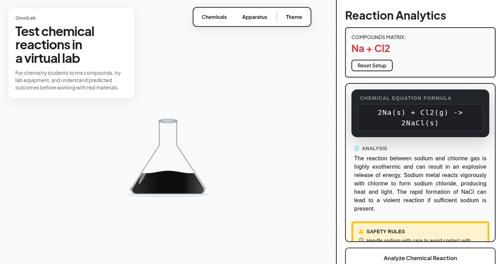

# OmniLab

OmniLab is a no-account virtual chemistry lab for chemistry students. The current release includes a deterministic matrix of common reactions and returns an educational equation, short explanation, and three safety rules for each supported pair.

[Open the live lab](https://omnilab-bk8q.onrender.com/) · [Try the prepared Sodium and Chlorine demo](https://omnilab-bk8q.onrender.com/demo/sodium-chlorine/)



## What the current release does

- Opens directly in the browser without an account or payment.
- Provides 27 substances in the searchable catalog, including common acids, bases, salts, oxidizers, and metals.
- Supports 23 order-independent reaction pairs, including ammonia with nitric acid and copper(II) sulfate with potassium hydroxide.
- Lets a student assemble the mixture and choose when to request a prediction.
- Returns an equation, a short explanation, and three safety rules for a supported result.
- Keeps the current setup and last result in the visitor's browser until they reset it.

## Start with the supported demo

The prepared demo opens the real lab with Sodium and Chlorine already selected. It does not submit anything automatically, so the visitor remains in control of whether to request the prediction.

1. Open the [prepared Sodium and Chlorine demo](https://omnilab-bk8q.onrender.com/demo/sodium-chlorine/).
2. Review the selected chemicals and setup.
3. Select **Analyze Chemical Reaction** to request the educational prediction.

## Educational and safety limits

OmniLab returns a stored educational reaction for supported chemical pairs selected in the browser. Its equations, explanations, and safety guidance simplify real chemistry and can be incomplete for a particular physical setup. Check important information against trusted chemistry sources and follow an instructor's guidance, trained supervision, and the safety procedures of any physical laboratory.

The current release supports a defined matrix of common reactions. It is a narrow educational prediction tool, not a validated chemistry simulation, and it does not reproduce every real-world condition, concentration, catalyst, or energy requirement.

## Run locally

Create a virtual environment and install the Python dependencies:

```bash
python3 -m venv .venv
source .venv/bin/activate
pip install -r requirements.txt
```

Prepare the local database and start Django:

```bash
python manage.py migrate
python manage.py runserver
```

Then open `http://127.0.0.1:8000/`.

Local development uses an explicitly non-production Django secret. Production
must provide `OMNILAB_DJANGO_SECRET_KEY` through protected environment settings;
copy `.env.example` to see the required variable without a committed value.

## Deploy with one command

After providing the required production environment variables, run:

```bash
./deploy/omnilab.sh
```

The command creates an isolated virtual environment, installs dependencies,
runs database migrations, collects static files, and starts Gunicorn. See the
[deployment guide](docs/deployment.md) for environment names, persistence,
health checks, and failure behavior.

## AI configuration

The current reaction library is deterministic and does not call an external AI model. If a future feature adds AI-backed functionality, `GITHUB_MODELS_API_KEY` is the only supported credential; copy `.env.example` to configure it locally.

## Tests

Run the Django test suite with:

```bash
python manage.py test
```

## Built with

- Django and Gunicorn
- TypeScript compiled to browser modules
- HTML5 Canvas and Bootstrap
- A deterministic server-side reaction matrix

## License

OmniLab is available under the [MIT License](LICENSE).
